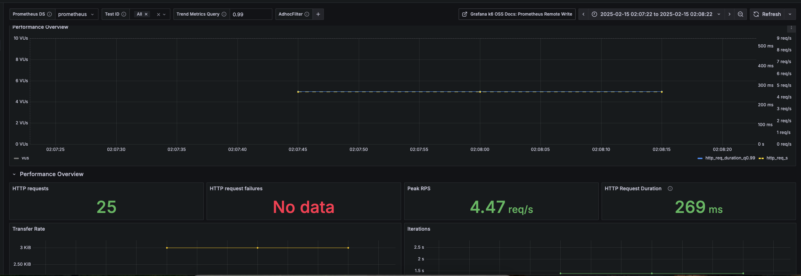

# Exemplo completo de teste de carga de ponta a ponta com k6-operator

## O que é esse repositório

O objetivo desse repositório é ser o mais didático possível para demonstrar o uso do [k6-operator](https://k6.io/):

* Usaremos minikube como ambiente local para o demo
* Usaremos prometheus e grafana para carregar as métricas de load-test e teremos todos os manifestos no repositório
* Usaremos uma aplicação de nginx como exemplo no teste

## Pre-requisitos

Será mais fácil se for feito em um minikube limpo, mas nada impede que faça em qualquer ambiente kubernetes
que tenha um ingress-controller de sua preferência para expor o ambiente de demo.

Implantaremos os pacotes helm do grafana e prometheus-operator juntamente com o k6 para expor as métricas.
Se tiver eles implantados só precisará se preocupar em implantar o k6.

O [helm](https://helm.sh/) deve ser instalado para poder gerenciar os pacotes a serem instalados.

O ambiente foi testado em kubernetes 1.31 e helm v3

Por fim e não menos importante tenha o [jq](https://jqlang.org/) instalado para que os scripts funcionem dentro do esperado.

### Como instalar

Boa parte desse guia se baseou [nesse artigo](https://vaibhavji.medium.com/deploying-prometheus-and-grafana-for-observability-on-a-minikube-cluster-using-daemonset-266e2df7e454) que deve receber os créditos

* Partindo do pressuposto que está com minikube instale o addon do ingress:

 ```bash
 minikube addon enable ingress
 ```

* Instale o repo oficial do grafana e os pacotes do grafana e k6

 ```bash
 helm repo add grafana https://grafana.github.io/helm-charts
 ```

* Iremos colocar todo o ambiente no namespace de `k6-demo` e o operador do k6 no namespace `k6` para simplificar exposição do ambiente. Execute o script de instalação `init.sh` que irá fazer a maior parte do processo

```bash
./init.sh
```

* Obtenha a senha do grafana recém instalado:

```bash
kubectl get secrets -n k6-demo grafana -o jsonpath="{.data.admin-password}" | base64 --decode ; echo
```

Inicialmente o ambiente demora um pouco para inicializar, veja o status do pod quickpizza (aplicação demo que iremos fazer o teste de carga) antes de iniciar o processo de teste de carga.

```bash
NAME                                 READY   STATUS     RESTARTS   AGE
grafana-f66fdbb5c-mntg2              1/1     Running    0          10s
prometheus-server-69949c64f5-cm89m   1/1     Running    0          2s
quickpizza-9787bff74-r2jq7           0/1     Init:0/2   0          2s
```

Assim que o pod estiver `running` podemos iniciar os testes de carga, mas antes iremos adequar o ambiente para que possamos acessar os diferentes serviços que estão implantados.

### Finalizando implantação do ambiente com plugin de ingress

Se você está usando o addon do ingress do minikube, ou mesmo está usando um nginx-ingress-controller pré instalado em seu kubernetes, instale os manifestos para acessar os serviços assim:

```bash
kubectl apply -f ./manifests/ingress-manifests/ingresses-rules.yaml
```

note que nas regras teremos 3 urls:

* prometheus.network.local
* quickpizza.network.local
* grafana.network.local

Crie essas entradas no seu `/etc/hosts` do seu ambiente local para seu host interprete essas entradas de hostname.

```config
127.0.0.1      prometheus.network.local
127.0.0.1      quickpizza.network.local
127.0.0.1      grafana.network.local
```

Finalmente utilize do comando tunnel do minikube para expor os serviços provisionados

```bash
minikube tunnel
```

Se tiver qualquer problema para expor a porta 80/443 por estar em uso, voce pode usar do comando de service do minikube

```bash
minikube service -n ingress-nginx ingress-nginx-controller
```

### Finalizando implantação do ambiente sem ingress

Não tem problema se não estiver querendo usar o ingress, mas iremos concentrar basicamente em expor o grafana que é onde iremos observar todas as métricas.

Use o minikube para expor o grafana e a aplicação de demo:

```bash
minikube service -n k6-demo grafana
minikube service -n k6-demo quickpizza
```

Lembrando que cada comando deve ser feito em um terminal isolado, pois o comando fica ativo enquanto a porta estiver aberta, e basta dar `ctrl+c` quando quiser finalizar.

### Realizando os testes de carga

Na pasta `manifests/testrun` contém dois manifestos:

* k6-load-test-script.yaml -> contém o código em js usando a lib do k6 definindo como vai ser executado o teste de carga, desde quantos usuários simultâneos irá simular até qual a curva de crescimento de requests ele irá tomar, e principalmente em quais endpoints e payloads ele irá executar.\
* k6-load-testrun.yaml -> O manifesto chave, esse manifesto foi criado justamente pensando na pessoa que irá realizar o teste de carga e abstrair o conhecimento de kubernetes, ele irá focar no máximo no contexto desse documento onde irá definir aonde irá enviar as métricas e qual o arquivo de config ele irá executar no teste de carga, esse exemplo não está tão abstraído quanto deveria, mas para nossa demonstração está bom o suficente.

* instale primeiramente o configmap do script de teste de carga:

```bash
kubectl apply -f ./manifests/testrun/k6-load-test-script.yaml
```

* logo após realize o teste de carga:

```bash
kubectl apply -f ./manifests/testrun/k6-load-testrun.yam
```

Você pode acompanhar o ciclo de vida dos pods olhando pro namespace `k6-demo`:

```bash
❯ k -n k6-demo get pods
NAME                                 READY   STATUS      RESTARTS   AGE
grafana-f66fdbb5c-mntg2              1/1     Running     0          33m
loadtest-1-7z6mx                     0/1     Completed   0          21s
loadtest-initializer-kxrvt           0/1     Completed   0          24s
loadtest-starter-5whjx               0/1     Completed   0          17s
prometheus-server-69949c64f5-cm89m   1/1     Running     0          33m
quickpizza-9787bff74-r2jq7           1/1     Running     0          33m
```

Onde os pods que iniciam com `loadtest` são os nossos de teste de carga, e por fim basta ir na dashboard no grafana pelo caminho:

Grafana > (use o usuário admin e a senha obtida na instrução no início deste documento) > Dashboards > k6 Prometheus (Native Histograms), e verá algo parecido com isso:



## E agora que já naveguei até aqui o que faço?

Bem se você chegou até aqui tenho umas brincadeiras interessantes pra você.

* Instale o addon do metrics-server no seu minikube e crie um [hpa](https://kubernetes.io/docs/tasks/run-application/horizontal-pod-autoscale/) para a aplicação quickpizza.
* No repo [oficial do quickpizza](https://github.com/grafana/quickpizza) existe uma pasta `k6` que contém inclusive esse exemplo básico, procure maneiras de realizar testes mais "massivos" no quickpizza com objetivo de fazer ele consumir mais cpu/memória, diminua requests/limits do quickpizza atual para que fique mais fácil de escalar.
* se você executar o comando `k -n k6-demo get ingresses.networking.k8s.io quickpizza-default -o json | jq -r '.status.loadBalancer.ingress[0].ip'` você irá obter o ip do ingress, ao invés de bater no endpoint do serviço (no qual chamamos de teste nivel 1 onde só avaliamos o comportamento da aplicação), troque para o ip do balanceador de carga do ingress no script de carga, você irá avaliar não somente o pod/serviço mas também o balanceador de carga no processo (que chamamos de teste nivel 2).

## Me ajuda a guardar os brinquedos?

Só executar esse comando:

```bash
./clean
```
